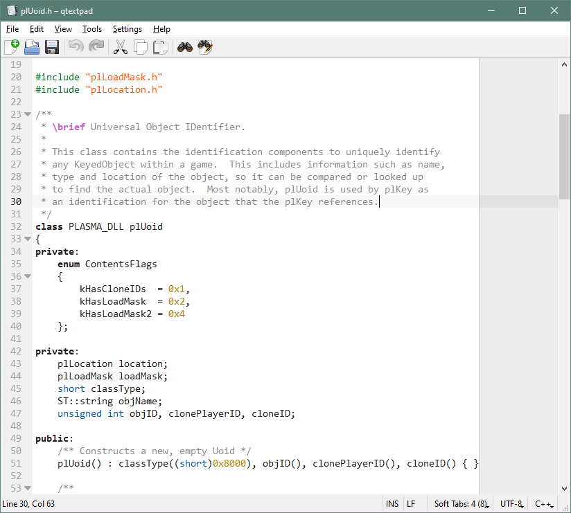
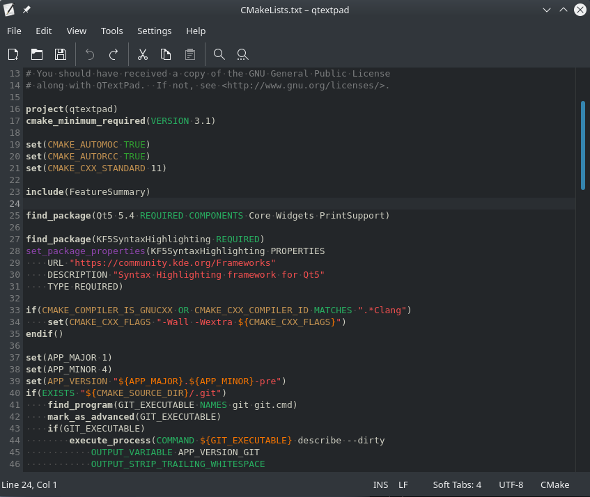

# QTextPad
***A Lightweight Qt-based code and text editor***

QTextPad is designed to be a simple, lightweight text editor that works
seamlessly and simply across several desktop platforms.

It was created out of a desire to have a fast and light editor like
the excellent [Notepad2](http://www.flos-freeware.ch/notepad2.html),
but with support for other platforms like Linux and macOS,
and for a much larger range of file formats.  To that end, QTextPad
uses the same Syntax Highlighting library that powers
[Kate](https://kate-editor.org/), giving it access to the same (ever
growing) repository of file formats that Kate supports.

## Features
* Supported on Windows, Linux, macOS
* Syntax highlighting support for hundreds of file types and dialects.
  * (Optional) online update of file type support, directly from
    Kate's repository.
* Support for reading and writing many common text encodings including
  Unicode, CP 437 (OEM/DOS), and Qt's
  [built-in encodings](https://doc.qt.io/qt-5/qtextcodec.html#details).
* Fast, lightweight design -- no plugins, session management, etc.
  to deal with when you just want to open a file.
* Attractive design with Light or Dark Theme.
* Many helpful code editing features inspired by other popular editors
  like Notepad2, Kate, gedit...

## Screenshots
Windows 10, default theme:

---

KDE Plasma, dark theme:

---

## Get It

* **Windows**:  You can download an installer or a portable zip file from
  the GitHub [releases](https://github.com/zrax/qtextpad/releases) page.
* **macOS**:  You can download a dmg compatible with macOS 10.12 (Sierra)
  or later from the GitHub [releases](https://github.com/zrax/qtextpad/releases)
  page.  Note that these packages are currently not signed.
* **Arch Linux**:  Install [qtextpad](https://aur.archlinux.org/packages/qtextpad)
  from AUR.
* **Build from source**:
  * Requirements:
    * [CMake](https://cmake.org/download)
    * [Qt5](https://www.qt.io/download) and
    * [KF5 Syntax Highlighting](https://download.kde.org/stable/frameworks)
  * On recent Linux platforms, you can usually find all of the above
    requirements in your distribution's repositories.
